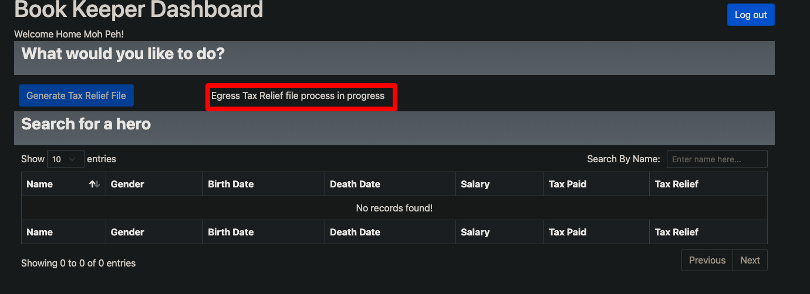

# Technical Assignment on THE OPPENHEIMER PROJECT

### To run all the tests including UI and API
```shell
./gradlew clean test
```


### Generate allure report
This project uses the Allure reporting framework. All the test results will be generated in the directory `/build/allure-results`

To view the allure test results in the browser, we have to install allure cli
```shell
brew install allure
```
to generate and open the report
```shell
allure serve ./build/allure-results
```

For my last successful run, I have placed the raw allure results at this location: `/docs/allure-results.zip` which can be viewed using allure serve command shown above.

### Issues/Gaps found while developing this assignment

1. The date formats given the requirement for birth and death dates are working, so I had to adjust the date formats to make it work.
2. In User story 2 and AC4, if there is an erroneous record in the csv file then the correct recors are not getting persisted which is against the requirement.
3. In User story 3 AC4,  total count of records
   being written into database table FILE is always coming as zero which is a bug.
4. Sometimes after downloading the tax relief file when we try to download it again without starting the application, it doesn't allow to download it again as it shows the message "file process in progress". Refer the below screenshot.


### Technical Details:
* We have used Selenium and Page Object Model to automate the UI
* For API automation we have use RestAssured library
* For data classes we have used lombok
* This assignment was done over a weekend so there is still lot of scope to refactor and improve the overall design.